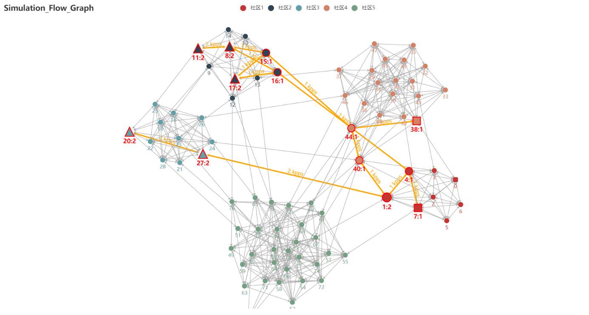

# flow_data_topo_simulation
> 使用第三方库pyecharts创建节点流关系图
> pyecharts官网： https://pyecharts.org/#/

### 使用说明：

1. 将拓扑文件放入community_small.txt中，**\t**分隔。 文件格式为：源节点，目的节点，原节点所在社区，目的节点所在社区。
   

2. 将节点负载和边负载关系放入flow_data.txt中，空格分隔。文件格式为：原节点，目的节点，原节点负载，目的节点负载，边权重。


3. 将最新的边负载关系放入flow_data_new.txt中，空格分隔。该文件用于区分新增加的flow，格式与flow_data.txt 格式相同。
   

4. 将节点类型关系放入node_type.txt，逗号分隔，共四行，第一行为receiver集合，第二行为source集合，第三行为switch节点集合，第四行为BGN节点集合。
   

5. 运行simulation_flow_graph.py 生成html文件。其中run()方法增加了对不同layout的支持，
```shell
"force"   是力引导模型，用于调试，可以拖动;
"manual"  可以初始化时确定部分点的坐标，坐标在 manual_set_node() 中确定;
"none"    用于最终展示，固定所有点的坐标，不可拖动，动画效果好;
```
   

6. 在浏览器打开html文件预览，如果需要定时刷新页面，需要在html文件中增加一行标签：
```html
<!--每隔10秒刷新一次页面-->
<meta http-equiv="Refresh" content="10"/> 
```


7. 获取实时渲染之后的点的坐标，在浏览器**console**中输入以下**function**中的**js**代码即可，获取到之后拷贝到`layout.txt`中。

- 注意：chart_<id> 要改成生成的html文件中对应的chart_id
```javascript
function getLayout() {
    var points = chart_d99899c6190a4318a834c40cb01a2c32.getModel().getSeriesByIndex(0).preservedPoints
    for (var i=0; i<=78; i++) {
        console.log(i + "," + points[i])
        document.write(i + "," + points[i]+"</br>")
    }
}
```

### 环境依赖：
- pyecharts 1.9.0
- numpy 1.19.2

**pyecharts源码安装(请使用本项目中的源码)**
```shell
$ cd pyecharts
$ pip install -r requirements.txt
$ python setup.py install
```


### 结果展示图样例：
