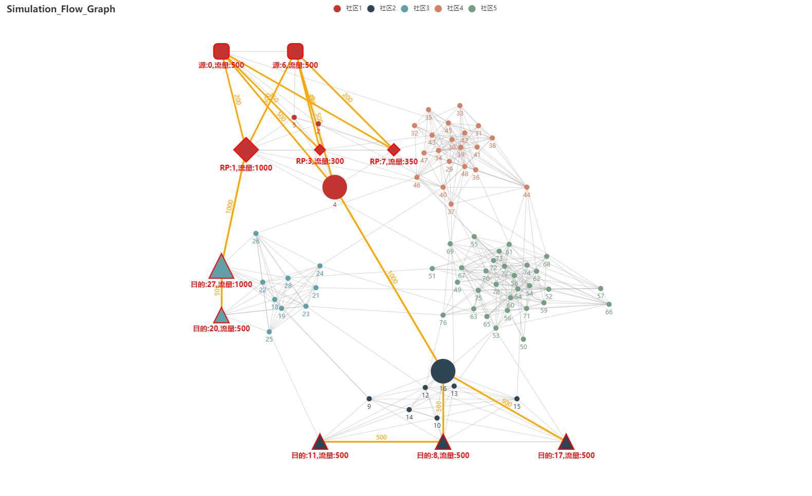
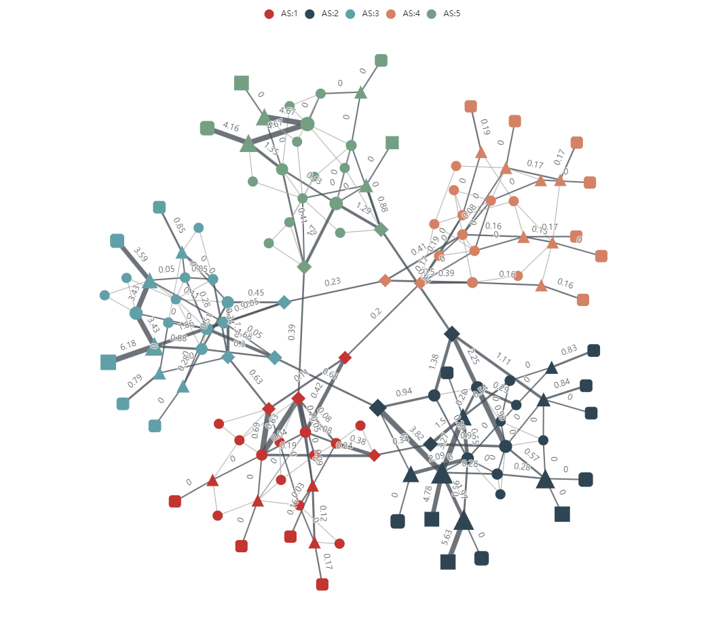

## Flow Data Topo Simulation 
**(数据流拓扑仿真器)**
> 使用第三方库pyecharts创建节点流关系图。该项目是基于pyecharts的一个demo，用于展示节点流关系图，可以用于展示网络拓扑图，节点流关系图等。
> pyecharts官网： https://pyecharts.org/#/

### 环境依赖：
- pyecharts 1.9.0
- numpy 1.19.2
- 如果用到topoGen, 还需要额外安装一些依赖。一键安装依赖可以使用以下命令：
```shell
$ pip install -r requirements.txt
```

**pyecharts源码安装(请使用本项目中的源码)**
```shell
$ cd pyecharts
$ pip install -r requirements.txt
$ python setup.py install
```
### 使用说明：
- 绘制拓扑图的主要代码在`simulation_flow_graph.py`中，其中`run()`方法中的参数可以控制生成的拓扑图的类型。
  - `layout.txt`文件中存放的是拓扑图的节点坐标，以及as号和控制域编号，逗号分隔。文件格式为：节点编号，x坐标，y坐标，as号，控制域编号。
  - `flow_data.txt`文件中存放的是拓扑图的边的负载信息，空格分隔。文件格式为：原节点，目的节点，原节点负载，目的节点负载，边权重。
  - `flow_data_new.txt`文件中存放的是拓扑图的边的负载更新信息，用于比较实验前后的负载变化，空格分隔。文件格式为：原节点，目的节点，原节点负载，目的节点负载，边权重。
  - `community_small.txt`文件中存放的是拓扑图的节点连接关系和社区信息，**\t**分隔。文件格式为：源节点，目的节点，原节点所在社区，目的节点所在社区。
  - `node_type.txt`文件中存放的是拓扑图的节点类型信息，逗号分隔。文件格式为：receiver集合，source集合，switch节点集合，BGN节点集合。
- 拓扑生成的代码在`topoGen/brite2topo.py`中，该脚本的主要功能为：
    1. 根据设定的生成规则，为原始只包含交换机的brite拓扑补充终端节点，生成brite_extend拓扑。
    2. 可以从brite_extend拓扑文件中提取信息，生成上述`community_small.txt`、`node_type.txt`、`layout.txt`三个文件。
- 其它说明：
  - simulation_flow_graph.py 生成html文件。其中run()方法增加了对不同layout的支持，
    ```shell
    "force"   是力引导模型，用于调试，支持拖动（**默认选项**）;
    "manual"  可以初始化时确定部分点的坐标，坐标在 manual_set_node() 中确定;
    "none"    用于最终展示，固定所有点的坐标，不可拖动，动画效果好;
    ```
  - 在浏览器打开html文件预览，如果需要定时刷新页面，需要在html文件中增加一行标签：
    ```html
    <!--每隔10秒刷新一次页面-->
    <meta http-equiv="Refresh" content="10"/> 
    ```
  - 获取实时渲染之后的点的坐标，在浏览器**console**中输入以下**function**中的**js**代码即可，获取到之后拷贝到`layout.txt`中。
    - 注意：chart_<id> 要改成生成的html文件中对应的chart_id
    ```javascript
    function getLayout() {
        var points = chart_d99899c6190a4318a834c40cb01a2c32.getModel().getSeriesByIndex(0).preservedPoints
        for (var i=0; i<=78; i++) {
            console.log(i + "," + points[i])
            document.write(i + "," + points[i]+"</br>")
        }
    }
    ```

### 结果展示图样例：

